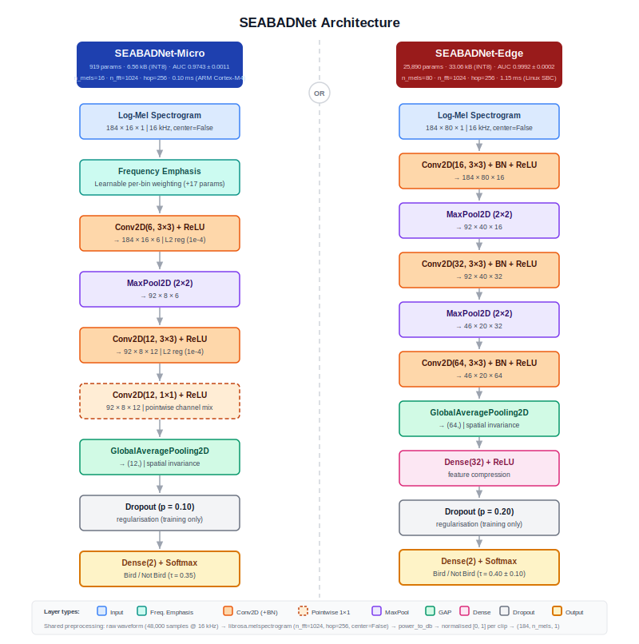

# SEABADNet

Lean TinyML CNNs for binary bird activity detection on embedded hardware. Derived from the [TinyChirp](https://arxiv.org/abs/2408.01976) CNN-Mel architecture and trained on the **SEABAD** (South-East Asian Bird Activity Detection) dataset.



| Variant | Hardware | Size | Recall | AUC |
|---|---|---|---|---|
| **SEABADNet-Micro** | ARM Cortex-M4 (AudioMoth, STM32F4) | 6.56 KB INT8 | ≥0.98 @ τ=0.35 | 0.9743 ± 0.0011 |
| **SEABADNet-Edge** | SBC (Raspberry Pi, Portenta X8) | 33.06 KB INT8 | ≥0.99 @ τ=0.50 | 0.9988 ± 0.0001 |

Recall is the primary deployment metric. AUC is reported for comparison.

## Repository layout

```
develop/    training and analysis scripts (ablation chain + threshold sweeps)
deploy/     firmware conversion tools (INT8 TFLite → C array)
```

## Dataset

**SEABAD** — binary classification (bird active / absent), 16 kHz, 3-second clips, 80/10/10 split.

Mel caches are keyed by `(n_mels, n_fft, hop_length)` and stored on an external drive:

```
/Volumes/Evo/cache4arxiv_fft{n_fft}_m{n_mels}/
```

## Quickstart

Pre-trained INT8 TFLite models (seed 42) are in `deploy/` — use them directly with `deploy/convert_xxd.sh` to embed in firmware.

To retrain from scratch, two arguments are required — everything else is locked:

```bash
python develop/train_micro.py \
    --dataset-path /path/to/seabad \
    --cache-dir    /path/to/cache_fft1024_m16
```

Results land in `results/seabadnet_micro_s42/` and include float32 + INT8 TFLite evaluation, confusion matrix, ROC/PR curves, and a parseable `results_summary.txt`.

## Requirements

- Python 3.10+, TensorFlow 2.15
- librosa, numpy, scikit-learn, matplotlib

## Citation

> M. Zabidi, "SEABADNet: Lightweight CNNs for Tropical Bird Audio Detection on Edge Devices," *manuscript in preparation*, 2026.

Based on: Huang et al., "TinyChirp: Bird Song Recognition Using TinyML," 2024.
