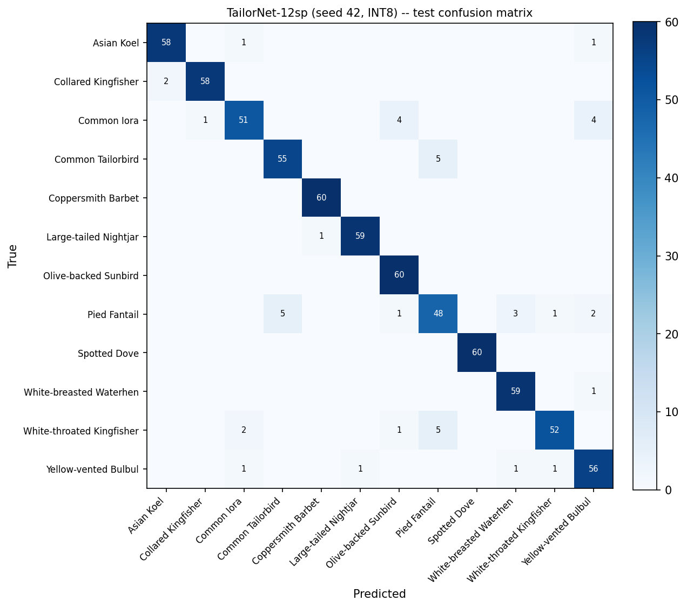

# TailorNet

A multi-species garden-bird classifier built as a variant of **DrongoNet-Edge**,
not a separate architecture: it reuses Edge's `build_deeper_gap` conv backbone
verbatim as a feature extractor, feeds it DrongoNet-Micro's exact mel
front-end (16 mels / 1024-pt FFT / 184 frames, so the same tensor a
DrongoNet-Micro gate already computes can be reused with zero second mel
pass), and closes with a MatchboxNet-style fully-convolutional epilogue
adapted from MynaNet 1o. Named for the Common Tailorbird, one of the
MyGardenBird species it classifies.

Trained and evaluated on **MyGardenBird**, a flat_dir + CSV-split multi-species
dataset (12- and 14-species variants), 80/10/10 split, same convention as
MynaNet's loader.

Full component-by-component provenance and design rationale is documented in
the [`tailornet.py`](tailornet.py) module docstring.

| Variant | Params | INT8 size | FP32 test acc. | INT8 test acc. |
|---|---|---|---|---|
| TailorNet-12sp (seed 42) | 35,340 | 47.2 KB | 93.75% | 93.89% |
| TailorNet-14sp (seed 42) | 35,598 | 47.5 KB | 92.38% | 92.38% |

Both are ~3.4x fewer parameters and ~4.1x smaller INT8 flash than the
reference MynaNet 1o (120,500 params, 193.4 KB INT8).

<details>
<summary>TailorNet-12sp — INT8 per-class report (seed 42, 720 test clips, 60/class)</summary>

|            Class          | Precision | Recall | F1-score |
|----------------------------|:---------:|:------:|:--------:|
| Asian Koel                 | 0.9667    | 0.9667 | 0.9667   |
| Collared Kingfisher         | 0.9831    | 0.9667 | 0.9748   |
| Common Iora                 | 0.9273    | 0.8500 | 0.8870   |
| Common Tailorbird           | 0.9167    | 0.9167 | 0.9167   |
| Coppersmith Barbet           | 0.9836    | 1.0000 | 0.9917   |
| Large-tailed Nightjar        | 0.9833    | 0.9833 | 0.9833   |
| Olive-backed Sunbird         | 0.9091    | 1.0000 | 0.9524   |
| Pied Fantail                 | 0.8276    | 0.8000 | 0.8136   |
| Spotted Dove                 | 1.0000    | 1.0000 | 1.0000   |
| White-breasted Waterhen      | 0.9365    | 0.9833 | 0.9593   |
| White-throated Kingfisher    | 0.9630    | 0.8667 | 0.9123   |
| Yellow-vented Bulbul         | 0.8750    | 0.9333 | 0.9032   |
| **accuracy**                |           |        | **0.9389** |
| macro avg                   | 0.9393    | 0.9389 | 0.9384   |
| weighted avg                 | 0.9393    | 0.9389 | 0.9384   |

</details>

<details>
<summary>TailorNet-14sp — INT8 per-class report (seed 42, 840 test clips, 60/class)</summary>

|            Class          | Precision | Recall | F1-score |
|----------------------------|:---------:|:------:|:--------:|
| Asian Koel                 | 0.8939    | 0.9833 | 0.9365   |
| Collared Kingfisher         | 1.0000    | 0.9333 | 0.9655   |
| Common Iora                 | 0.9375    | 0.7500 | 0.8333   |
| Common Myna                  | 0.9365    | 0.9833 | 0.9593   |
| Common Tailorbird           | 0.9767    | 0.7000 | 0.8155   |
| Coppersmith Barbet           | 1.0000    | 1.0000 | 1.0000   |
| Large-tailed Nightjar        | 0.9833    | 0.9833 | 0.9833   |
| Olive-backed Sunbird         | 0.8939    | 0.9833 | 0.9365   |
| Pied Fantail                 | 0.6944    | 0.8333 | 0.7576   |
| Spotted Dove                 | 1.0000    | 1.0000 | 1.0000   |
| White-breasted Waterhen      | 0.9194    | 0.9500 | 0.9344   |
| White-throated Kingfisher    | 0.9180    | 0.9333 | 0.9256   |
| Yellow-vented Bulbul         | 0.8769    | 0.9500 | 0.9120   |
| Zebra Dove                   | 0.9828    | 0.9500 | 0.9661   |
| **accuracy**                |           |        | **0.9238** |
| macro avg                   | 0.9295    | 0.9238 | 0.9233   |
| weighted avg                 | 0.9295    | 0.9238 | 0.9233   |

</details>

Full reports (with support column) are in each run's `classification_report_int8.txt` / `classification_report_fp32.txt`.

**TailorNet-12sp — INT8 confusion matrix (seed 42, 720 test clips, 93.89% accuracy):**



Most confusion is Pied Fantail ↔ Common Tailorbird (5 clips) and
White-throated Kingfisher ↔ Pied Fantail (5 clips); every other species
pair has at most 2 misclassified clips. Raw counts are also in that run's
`confusion_matrix_int8.txt` / `.npz`.

A 14sp confusion matrix isn't published here: reconstructing that run's
exact test set (base 12sp + the 2 "plus-edition" species merged) reproduces
a materially different accuracy from the recorded 92.38%, so which precise
split the original run used is unresolved and a matrix built against the
wrong split would misrepresent the model. The 14sp INT8 model, its
classification report, and `tailornet_summary.json` are still accurate and
usable as-is -- only the extra confusion-matrix artifact is withheld
pending that resolution.

## Repository layout

```
tailornet.py                       model definition, dataset loader, training/eval CLI
eval_tailornet_seed7.py             reproduce a seed's INT8 test accuracy from its saved model
retrain_tailornet_seed7_history.py  retrain one seed with a combined warmup+finetune epoch history log
results_tailornet/                 one representative run per species count (seed 42):
                                    INT8 TFLite model, classification report,
                                    confusion matrix (12sp only, see above), summary JSON
```

`tailornet.py` generates `confusion_matrix_{int8,fp32}.{txt,npz,png}` in
`output_dir` automatically as part of evaluation -- no separate plotting
step required (the `.png` needs matplotlib; if it's missing the `.txt`/
`.npz` are still written). It also matches the splits CSV's `file_id`s
against on-disk filenames case-insensitively (the MyGardenBird splits
CSVs use `XC...` while the audio files are `xc....wav`); a case-sensitive
match silently resolves 0 clips for every split.

## Quickstart

Pre-trained INT8 TFLite models (seed 42) are in `results_tailornet/` — use
them directly for deployment, no training required:

```
results_tailornet/tailornet_12sp_epi128_drop0.2_mixup0.2_rand42/model_int8.tflite
results_tailornet/tailornet_14sp_epi128_drop0.2_mixup0.2_rand42/model_int8.tflite
```

Input tensor is `(184, 16, 1)` INT8-quantized mel-spectrogram (16 mels /
1024-pt FFT / 184 frames — DrongoNet-Micro's exact front-end, see
[`tailornet.py`](tailornet.py) for `compute_mel_spectrogram`); output is a
softmax over the classes listed in that run's `classification_report_int8.txt`,
alphabetically sorted.

To retrain from scratch instead:

```bash
python tailornet.py \
    --flat_dir   /path/to/mygardenbird16khz \
    --splits_csv /path/to/splits_mip_80_10_10.csv \
    --random_seed 42
```

Only `--flat_dir` and `--splits_csv` are required; class count is inferred
from the species subdirectories present under `flat_dir`. See
`python tailornet.py --help` for the full set of training knobs (dropout,
mixup alpha, warmup/finetune epochs and learning rates, epilogue width).
Results land in a directory containing FP32 + INT8 TFLite evaluation, a
classification report, and a parseable `tailornet_summary.json`.

To reproduce a specific seed's reported INT8 accuracy from its saved model
(i.e. a `--output_dir` produced by the `tailornet.py` run above):

```bash
python eval_tailornet_seed7.py \
    --flat_dir   /path/to/mygardenbird16khz \
    --splits_csv /path/to/splits_mip_80_10_10.csv \
    --result_dir /path/to/that/run/output_dir
```

## Requirements

- Python 3.10+, TensorFlow 2.15, `tf_keras`
- librosa, numpy, scikit-learn
- matplotlib (optional, for the confusion-matrix `.png`)

## Relation to DrongoNet

TailorNet is downstream of this repository's own `develop/6b_micro_final.py`
(mel front-end) and `develop/6c_edge_final.py` (backbone) — see those files
for the components it reuses verbatim.
